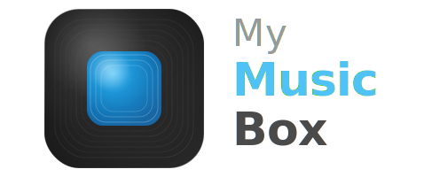

<p align="center">
  
</p>

A personal desktop app for building and managing a flat-file music collection — built with Electron + Svelte.

The main use case is a car stereo (or any device) that plays audio from a USB drive or SD card. You search YouTube, download tracks as MP3s, and sync the collection to a folder that you copy to your drive. Everything stays as plain files — no proprietary library format, no cloud dependency.

**What it does:**

- Search YouTube and download audio as normalized MP3s via yt-dlp + ffmpeg
- Keep a local SQLite catalogue (title, artist, duration, file size, status)
- Play tracks directly in the app with a queue, scrubber, and mini player mode
- Detect missing files and re-download them if needed
- Sync check to reconcile the catalogue against files on disk

## Download

**[Download for macOS (Apple Silicon)](https://github.com/lexey111/my-music-box/releases/latest/download/My.Music.Box-0.1.3-arm64.dmg)**

Or see all releases on the [Releases page](https://github.com/lexey111/my-music-box/releases).

> macOS may show a security warning since the app is not notarized. To open it: right-click the app → Open → Open.

## Requirements

- macOS (Apple Silicon or Intel)
- [yt-dlp](https://github.com/yt-dlp/yt-dlp) — audio downloading

Install via Homebrew:

```sh
brew install yt-dlp
```

> `ffmpeg` and `ffprobe` are bundled inside the app — no separate installation needed.

## Development

```sh
npm install
npm run dev
```

## Build

```sh
npm run package
```

## Legal Disclaimer

This application can download audio from online sources including YouTube.

**Users are solely responsible for ensuring they have the legal right to download any content.** In particular:

- Downloading YouTube videos or audio may violate [YouTube's Terms of Service](https://www.youtube.com/t/terms).
- Downloaded content may be protected by copyright. Downloading copyrighted material without authorization may violate applicable law, including the DMCA (US) and equivalent legislation in other jurisdictions.
- This tool is intended for personal use with content you own or have rights to (e.g. your own uploads, Creative Commons, or public domain material).

The authors of this software assume no liability for any misuse or illegal use by end users.

## License

[MIT](LICENSE)
